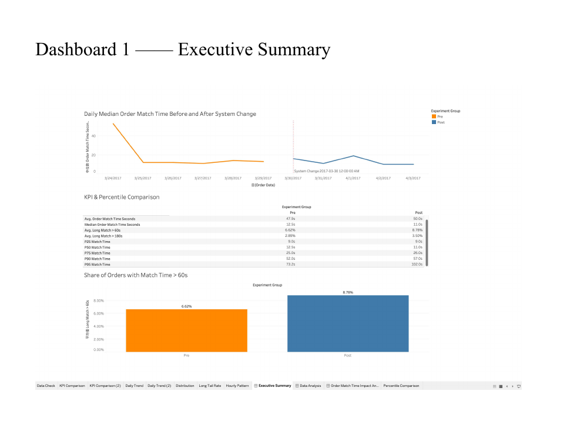
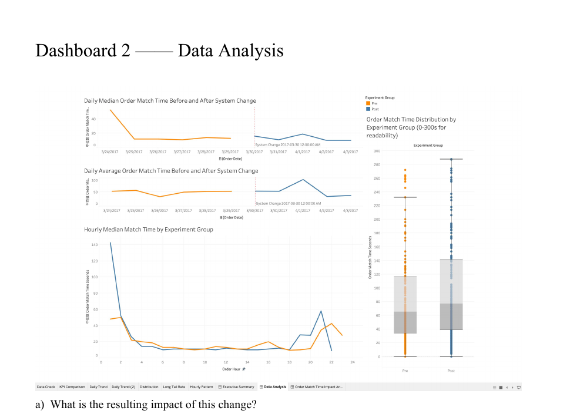

# Order Matching System Change Analysis

## Project overview

This project evaluates whether a platform allocation-system change improved the time between order creation and driver acceptance. The public portfolio version uses an anonymous platform scenario; source records and identifying business context are intentionally excluded.

| Item | Description |
|---|---|
| Tool | Tableau |
| Analysis design | Pre/post observational comparison |
| Change date | March 30, 2017 |
| Primary outcome | Order match time |
| Guardrails | Mean, median, P75/P90/P95, share above 60 seconds, share above 180 seconds |
| Deliverable | Two dashboards and an executive recommendation |

## Business question

Did the allocation change reduce order match time without making slow-match cases worse?

## Executive answer

The change did **not** produce a clear overall improvement. Typical orders became slightly faster: median match time declined from 12.5 seconds to 11.0 seconds. The long tail moved in the opposite direction, however. Average match time rose, the share of orders taking more than 60 seconds increased, and P90/P95 both worsened.

The practical conclusion is to avoid declaring the change successful from the aggregate median alone. The next iteration should target slow-match orders and be evaluated through a controlled experiment with long-tail guardrails.

## Key results

| Metric | Before | After | Interpretation |
|---|---:|---:|---|
| Average match time | 47.9 s | 50.0 s | Worsened by 2.1 s |
| Median match time | 12.5 s | 11.0 s | Improved by 1.5 s |
| Orders above 60 s | 6.62% | 8.78% | Worsened by 2.16 percentage points |
| Orders above 180 s | 2.89% | 3.50% | Worsened by 0.61 percentage points |
| P75 match time | 25.0 s | 26.0 s | Slightly worse |
| P90 match time | 52.0 s | 57.0 s | Worse |
| P95 match time | 73.25 s | 102.0 s | Materially worse |



## Analysis approach

1. Calculated order match time from the difference between order creation and driver response timestamps.
2. Split orders into pre-change and post-change groups using the implementation timestamp.
3. Compared central tendency, percentile metrics, and slow-match rates.
4. Reviewed daily trends to check whether the aggregate result was driven by a small number of dates.
5. Reviewed hourly medians to identify time-of-day heterogeneity.
6. Examined the full distribution because match time is strongly right-skewed.



## Why the average was not enough

Most orders matched quickly, while a small number took much longer. Those cases pulled the mean upward. Median match time described a typical order, but P90, P95, and the shares above 60 and 180 seconds exposed the customer experience in the tail. Reading these metrics together revealed the central trade-off: a small improvement for typical orders accompanied by worse outcomes for the slowest orders.

## Experiment limitations and redesign

The pre/post comparison is descriptive and cannot isolate the system change from other factors. The observation window is short, order mix may differ between periods, and driver supply, demand intensity, weekday, and hour-of-day effects could confound the result.

A stronger test would:

- Randomly assign eligible orders or markets to control and treatment.
- Pre-register median match time as the primary metric and P90/P95 plus slow-match rates as guardrails.
- Stratify assignment by market, hour, and demand level.
- Track driver supply, order volume, completion, cancellation, and customer outcomes.
- Estimate the required sample size before launch and run long enough to cover weekday and weekend cycles.
- Analyze heterogeneous effects to identify where the change helps or hurts.

## Tableau calculated fields

```text
Order Match Time Seconds
DATEDIFF('second', [Order Create Timestamp], [Driver Response Timestamp])

Experiment Group
IF [Order Create Timestamp] < #2017-03-30 00:00:00# THEN "Pre"
ELSE "Post"
END

Long Match > 60s
IF [Order Match Time Seconds] > 60 THEN 1 ELSE 0 END
```

## My contribution

I defined the KPI framework, created the Tableau calculated fields, built the executive and diagnostic dashboards, analyzed the distribution and time-based segments, translated the findings into a rollout recommendation, and proposed a stronger experimental design.

## Files

- [Full Tableau report (PDF)](Order_Matching_System_Change_Analysis.pdf)
- [Executive dashboard](Order_Matching_Executive_Summary.png)
- [Diagnostic dashboard](Order_Matching_Diagnostic_Analysis.png)
