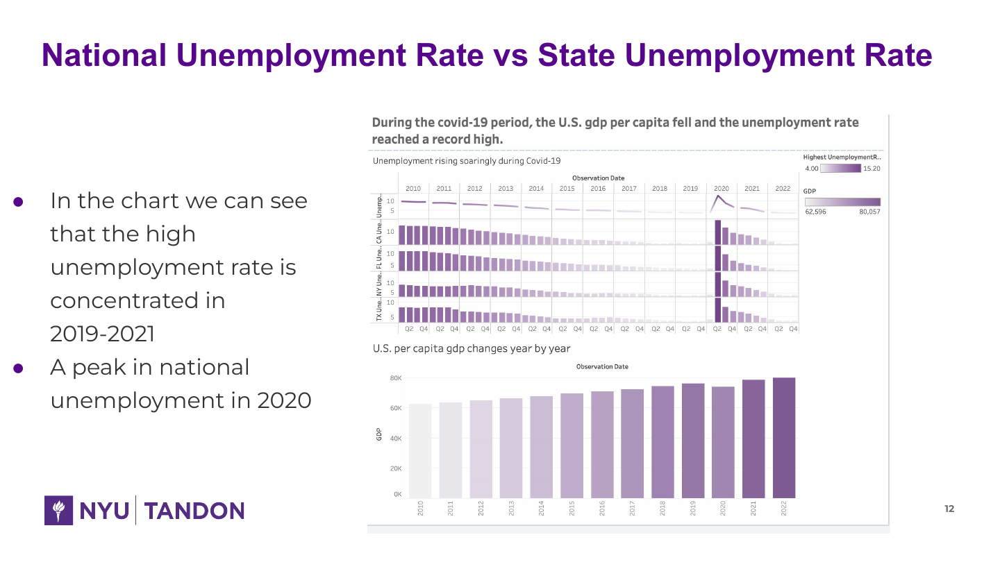
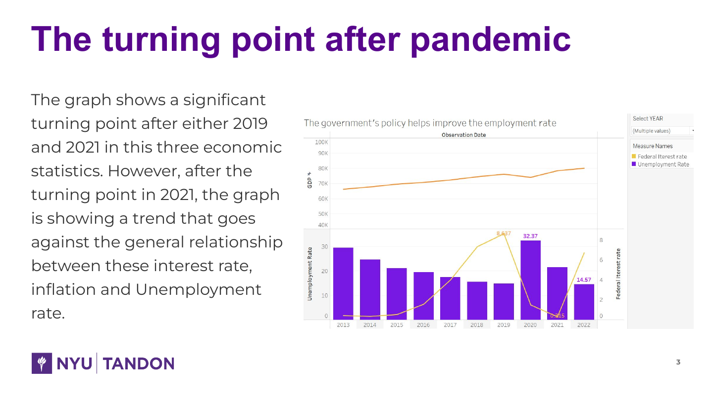
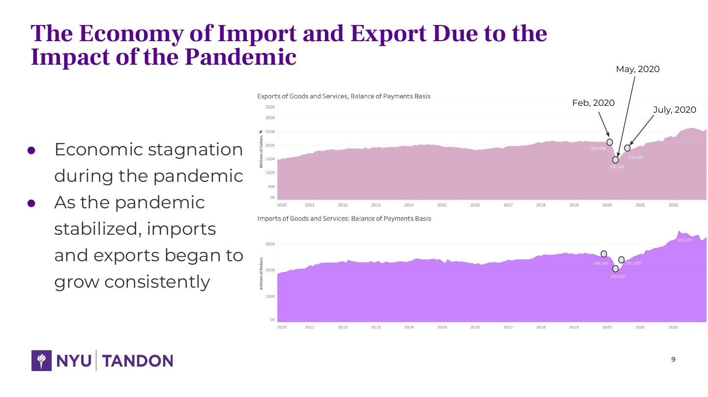

# U.S. Economic Recovery After COVID-19

## Project overview

This Tableau storytelling project was developed for NYU Tandon's Data Visualization for Business Intelligence course. It explores how the pandemic and subsequent recovery appear across unemployment, interest rates, trade flows, GDP, fiscal conditions, and selected state labor markets.

The project is presented as an exploratory economic narrative. The charts show timing, co-movement, and regional differences; they do not by themselves establish causal effects of a particular policy.

| Item | Description |
|---|---|
| Tool | Tableau |
| Format | 14-slide visual story |
| Time horizon | Primarily 2010-2022 |
| Geographic scope | United States, with selected state comparisons |
| Topics | Unemployment, interest rates, GDP, inflation context, trade, fiscal balance, equity market |

## Questions explored

- Where are the major turning points before, during, and after the pandemic?
- How did national and selected state unemployment move through the shock and recovery?
- How did imports and exports respond to the disruption?
- What relationships are visible among rates, labor-market conditions, output, and inflation pressure?

## Main observations

1. **The labor-market shock was abrupt and geographically broad.** National and selected state unemployment series show a pronounced 2020 spike followed by a multi-year decline.
2. **Trade activity recovered after the initial disruption.** Both imports and exports fell around the early pandemic period and then resumed growth, with imports rising particularly strongly during the recovery.
3. **The policy environment changed as the recovery matured.** Near-zero rates supported the initial response, while later inflation pressure coincided with a shift toward higher rates.
4. **Regional paths shared a common cycle but differed in magnitude.** Comparing states with the national series made it easier to distinguish the common shock from local labor-market variation.

## Visual storytelling structure

The presentation moves from the national turning point to policy context, regional employment, trade flows, and a final synthesis. It combines annotated line charts, bars, small multiples, and dashboard filters to make changes in level and direction visible.

### Economic turning point

### Trade disruption and recovery

## My contribution

I selected the economic indicators, structured the visual narrative, built the Tableau views and interactive filters, compared national and regional labor-market patterns, annotated major turning points, and presented the findings and limitations as a business-intelligence story.

## Limitations

- The analysis is exploratory and should not be interpreted as a causal policy evaluation.
- Indicators use different frequencies and units, so aligned movement does not imply a direct mechanism.
- A stronger follow-up would document every public data source, normalize time frequencies, use real rather than nominal measures where appropriate, and test results across alternative state groupings.

## Files

- [Full project presentation (PDF)](US_Economic_Recovery_Visualization.pdf)
- [Economic turning-point view](US_Economic_Turning_Point.png)
- [Trade recovery view](US_Trade_Recovery.png)
- [National and state unemployment view](US_National_State_Unemployment.png)
